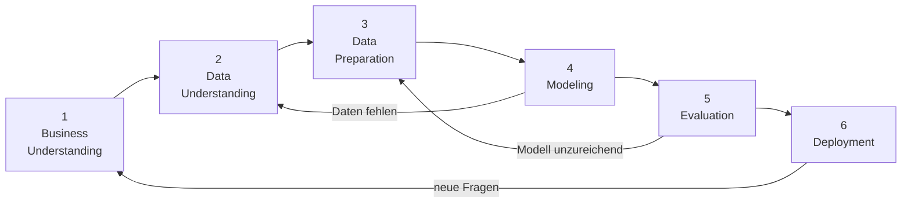

# CRISP-DM

**Zusammenfassung**: CRISP-DM ist der weltweit meistgenutzte Prozessrahmen für Data-Mining-Projekte – und der strukturelle Rahmen, dem der Workshop folgt.

**Quellen**: [[Cross-industry standard process for data mining.md]], `CRISP-DM_Process_Diagram.png`

**Zuletzt aktualisiert**: 2026-04-24

---

## Was ist CRISP-DM?

CRISP-DM (*Cross-Industry Standard Process for Data Mining*) ist ein offenes Prozessmodell, das 1996 von einem EU-Konsortium (Daimler, NCR, Teradata u. a.) entwickelt wurde. Es beschreibt, wie Data-Mining-Projekte typischerweise ablaufen – unabhängig von Branche, Werkzeug oder Anwendungsdomäne.

Es ist das meistgenutzte Modell in der Praxis (KDNuggets-Umfragen 2002–2014) und gilt als *de-facto-Standard* für Data-Mining-Projekte.

## Die sechs Phasen

Die Phasenfolge ist nicht starr – Rücksprünge sind explizit vorgesehen. Der äußere Zyklus symbolisiert, dass ein abgeschlossenes Projekt neue Fragen aufwirft.

### 1. Business Understanding
Ziel des Projekts aus fachlicher Sicht klären: Was wollen wir lösen? Wie sieht Erfolg aus?

*Im Workshop:* Wir verstehen, wie DDoS-Angriffe funktionieren, und entwickeln eine Vorstellung davon, welche messbaren Merkmale eines Netzwerkflows einen Angriff verraten könnten (z. B. Paketgröße, Antwortverhalten des Servers).

### 2. Data Understanding
Verfügbare Daten sichten, Qualität prüfen, erste Muster entdecken.

*Im Workshop:* Den CICIDS2017-Datensatz lesen und verstehen – welche Daten sind enthalten, was bedeuten die einzelnen Features, und wie lässt sich gutartiger von bösartigem Datenverkehr unterscheiden? Werkzeuge: Data Table, Scatter Plot.

### 3. Data Preparation
Daten in eine für das Modell geeignete Form bringen: Bereinigung, Feature-Auswahl, Sampling.

*Im Workshop:* Bereits erledigt – `workshop_ids.tab` (10 000 Flows, 11 Features, Inf/NaN bereinigt, Orange-.tab-Header gesetzt) wurde vorab aufbereitet, damit er direkt in Orange geladen werden kann. Im echten Projekt ist dies oft der aufwändigste Schritt.

### 4. Modeling
Modell(e) auswählen, Parameter einstellen, trainieren.

*Im Workshop:* Entscheidungsbaum trainieren (Tree-Widget), Tree Viewer lesen.

### 5. Evaluation
Modell auf Tauglichkeit für das Business-Ziel prüfen – über reine Accuracy hinaus.

*Im Workshop:* Wir bewerten, ob das Filterergebnis auf Basis der vom ML-System erzeugten Regeln gut genug in gutartigen und bösartigen Netzwerkverkehr einteilen kann, um eine spürbare Entlastung der NGFW zu erreichen. Werkzeuge: Test and Score, Confusion Matrix; Diskussion über Alert Fatigue und FP vs. FN im IDS-Kontext.

### 6. Deployment
Modell in die Praxis überführen.

*Im Workshop:* Das ML-System so einrichten, dass es beim Kunden sinnvoll arbeiten kann. Die Minimalform wäre, die erzeugte Regelkonfiguration (Signaturpflege) im betroffenen Netzwerk einzuspielen und zu aktivieren. Didaktisch: Modellvergleich (Erklärbarkeit vs. Genauigkeit) und Transfer in den Schulunterricht.

## Mapping Workshop ↔ CRISP-DM

| CRISP-DM-Phase | Workshop-Phase | Inhalt |
|---|---|---|
| Business Understanding | Einstieg (10 min) | Wie funktioniert DDoS? Was lässt sich messen, um einen Angriff zu entdecken? |
| Data Understanding | Daten erkunden (15 min) | Datensatz lesen: Welche Daten sind enthalten, was bedeuten sie, wie trennt man BENIGN von DDoS? |
| Data Preparation | *(vorbereitet)* | `workshop_ids.tab`: bereinigt, 11 Features, Orange-Format |
| Modeling | Entscheidungsbaum (25 min) | Tree trainieren, Tree Viewer |
| Evaluation | Modellbewertung (20 min) | Entlastet der Filter die NGFW spürbar? Accuracy, Confusion Matrix, Alert Fatigue |
| Deployment | Abschluss (10 min) | ML-Regelwerk im Kundennetz einrichten und aktivieren; Modellwahl, Transfer |

## Didaktischer Wert für den Workshop

CRISP-DM macht deutlich, dass das Vorgehen im Workshop **kein Zufall** ist, sondern einer etablierten, industriell erprobten Methodik folgt. Für Lehrkräfte mit Cisco-Hintergrund ist es relevant zu sehen:

- Data Mining ist strukturiert – es gibt keinen „Knopf, der KI macht".
- Die Evaluation (Phase 5) ist explizit von Modeling (Phase 4) getrennt – weil ein gutes Modell am falschen Ziel scheitern kann.
- Deployment (Phase 6) schließt eine fachliche Entscheidung ein: Welches Modell ist erklärbar genug, um es vor Vorgesetzten und Schülern zu verteidigen?

## Verwandte Seiten

- [[Workshop_Konzept]]
- [[Orange_Klassifikations_Workflow]]
- [[CICIDS2017]]
- [[Cisco_Sicherheitsarchitektur]]
