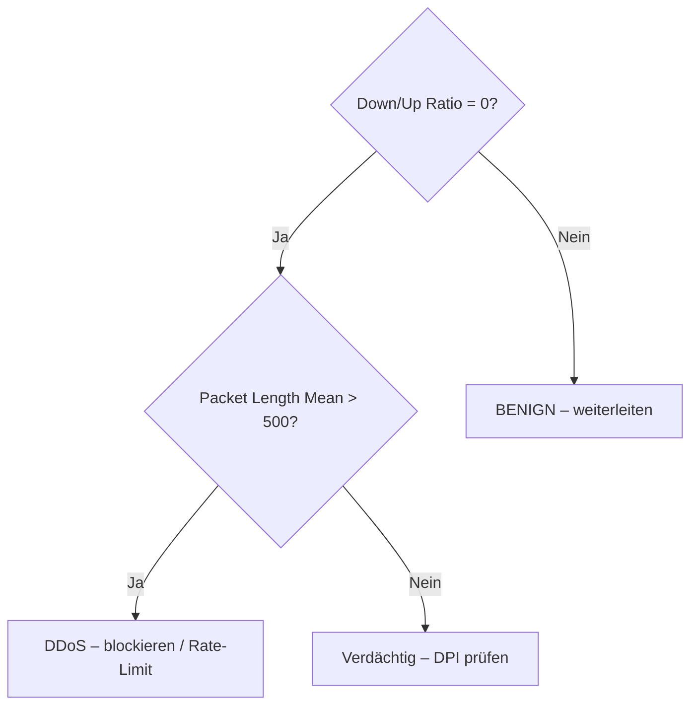

# Cisco-Sicherheitsarchitektur und Flow-basierte Erkennung

**Zusammenfassung**: Überblick über Cisco-Lösungen zur Angriffserkennung und warum flow-basierte ML-Vorfilterung (wie im Workshop) in realen Cisco-Umgebungen sinnvoll ist.

**Quellen**: Diskussion mit Nutzer (2026-04-19)

**Zuletzt aktualisiert**: 2026-04-19

---

## Cisco-Appliances zur Angriffserkennung

### Cisco Firepower / NGFW
- Next-Generation Firewall mit integriertem IPS (basiert auf Snort-Regeln)
- **Deep Packet Inspection (DPI)**: prüft Header und Payload jedes Pakets
- Rechenintensiv – bei hohem Verkehrsvolumen ein Flaschenhals
- Im CICIDS2017-Labor wäre Firepower das primäre Erkennungssystem

### Cisco Secure Network Analytics (ehem. Stealthwatch)
- Analysiert **NetFlow / IPFIX** statt Payloads
- Verwendet dieselben Flow-Metriken wie [[CICFlowMeter_Features]]: Paketanzahl, Bytes/s, Flag-Counts, Flussdauer
- Setzt intern ML-Modelle für Verhaltensanomalien ein
- **Konzeptionell direkt verwandt mit dem Workshop-Ansatz**

### Cisco ASA mit IPS-Modul
- Klassische signaturbasierte Erkennung
- Bei DDoS-Angriffen (wie im CICIDS2017-Freitag) leicht überlastbar

### Cisco Umbrella
- DNS-Layer-Sicherheit, kein Flow-basierter Ansatz

---

## Das Überlastungsproblem

Bei einem DDoS-Angriff wie dem LOIT-Angriff im CICIDS2017-Datensatz (Freitag, 15:56–16:16 Uhr) treffen tausende Flows pro Sekunde ein. DPI muss jeden davon vollständig analysieren – das übersteigt schnell die Kapazität.

**Typisches Muster in SOC-Umgebungen**:
1. DDoS flutet das Netz → Firepower-CPU steigt auf 100 %
2. Alarme häufen sich → Alert Fatigue
3. Echte Angriffe (gleichzeitig laufende Infiltration) werden übersehen

---

## Flow-Vorfilterung als Lösung

Ein einfacher Entscheidungsbaum mit 2–3 Regeln kann DDoS-Traffic mit ~95 % Genauigkeit in Mikrosekunden klassifizieren:

**Ergebnis**: 80–90 % des Traffics wird ohne DPI vorsortiert → Firepower muss nur noch den Rest vollständig prüfen.

Dieses Prinzip nennt sich **Traffic Triage** und ist in hochvolumigen Umgebungen (ISPs, Rechenzentren) etablierte Praxis.

---

## Verbindung zu Cisco Secure Network Analytics

Stealthwatch implementiert genau diesen Ansatz industriell:

| Workshop-Konzept | Stealthwatch-Äquivalent |
|---|---|
| CICFlowMeter-Features | NetFlow / IPFIX Felder |
| Entscheidungsbaum | Security Events Engine (regelbasiert) |
| Random Forest | Cognitive Analytics (ML-Modul) |
| Confusion Matrix / FP-Rate | Alarm-Prioritäten im SOC |
| Alert Fatigue (FP) | Bekanntes Problem, adressiert durch Tuning |

---

## Didaktischer Einsatz im Workshop

Dieser Cisco-Bezug lässt sich in Phase 6 (Diskussion) einbringen:

> „Was ihr heute gebaut habt, ist konzeptionell dasselbe wie Cisco Secure Network Analytics – nur ohne die industrielle Infrastruktur dahinter. Der Unterschied: Stealthwatch verarbeitet Millionen Flows pro Minute, euer Modell läuft auf einem Laptop. Das Prinzip ist identisch."

**Anschlussfragen**:
- „Welche Cisco-Lösung setzt ihr in eurer Schule oder bei Praktikumsbetrieben ein?"
- „Würdet ihr einem Entscheidungsbaum vertrauen, der DDoS-Traffic automatisch blockiert?"
- „Was passiert, wenn die Vorfilterung einen legitimen Dienst als DDoS klassifiziert?" (False Positive im produktiven Netz)

---

## Verwandte Seiten

- [[Angriffsszenarien]]
- [[CICFlowMeter_Features]]
- [[Orange_Klassifikations_Workflow]]
- [[Workshop_Konzept]]
- [[CICIDS2017]]
