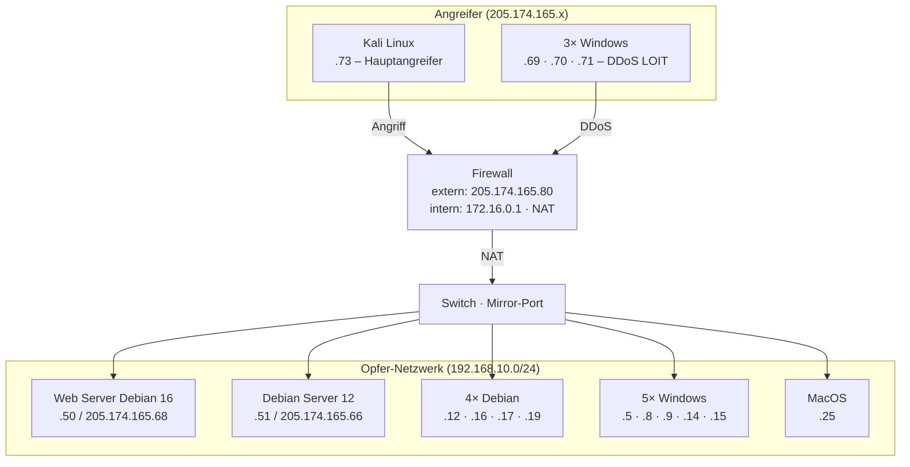

# On-Premise-Netzwerktopologie

**Zusammenfassung**: Detaillierter Aufbau des Labornetzwerks, in dem der CICIDS2017-Datensatz erhoben wurde. Typische Unternehmenstopologie mit Firewall, Switch und gemischtem Client-Park.

**Quellen**: (Quelle: [[IDS 2017  Datasets  Research  Canadian Institute for Cybersecurity.md]])

**Zuletzt aktualisiert**: 2026-04-16

---

## Netzwerkdiagramm



## Komponenten

### Angreifer-Netzwerk (extern)
- **Kali Linux** (`205.174.165.73`): Hauptangreifer für fast alle Szenarien (Brute Force, DoS, Web Attack, Port Scan, Infiltration)
- **3× Windows** (`205.174.165.69–71`): Für DDoS LOIT am Freitag – simuliert verteilten Angriff

### Firewall
- Führt NAT durch: Pakete von 205.174.165.73 → 205.174.165.80 → 172.16.0.1 → 192.168.10.50
- Angriffspfad: `Kali (205.174.165.73) → Firewall extern (205.174.165.80) → Firewall intern (172.16.0.1) → Opfer`
- Antwortpfad: `Opfer → 172.16.0.1 → 205.174.165.80 → 205.174.165.73`

### Opfer-Netzwerk (intern, 192.168.10.0/24)
12 Maschinen mit verschiedenen Betriebssystemen – bewusst heterogen für realistische Simulation.

Zwei öffentlich erreichbare Server (auch von außen adressierbar):
- Web Server Debian: primäres Angriffsziel für DoS, Web Attack, Brute Force
- Debian Server 12: Ziel für Heartbleed

## Warum diese Topologie für den Workshop ideal ist

1. **Cisco-Lehrkräfte erkennen den Aufbau sofort**: Firewall mit NAT, interne Segmentierung, DMZ-ähnliche Serverzone
2. **Heterogenität**: Verschiedene OS – wie in echten Unternehmensnetzen
3. **Klare Angreifer/Opfer-Rollen**: Didaktisch sehr klar strukturiert
4. **Simulierter Benutzerverkehr**: 25 simulierte Nutzer erzeugen HTTP, HTTPS, FTP, SSH, E-Mail-Traffic → realistisches Hintergrundrauschen

## Verbindung zum Unterrichtsstoff

| Netzwerkkomponente | Cisco-Curriculum-Bezug |
|---|---|
| Firewall mit NAT | CCNA: NAT/PAT, Firewall-Konzepte |
| Opfer-Webserver | CCNA Security: Serverabsicherung |
| Kali als Angreifer | CyberOps: Penetration Testing |
| IDS/IPS-Konzept | CyberOps: Intrusion Detection |
| Gemischter Client-Park | IT-Essentials: OS-Vielfalt |

## NAT-Prozess im Detail (für Unterricht)

Der Angriff läuft immer über NAT:
```
Angriff:  205.174.165.73 → 205.174.165.80 → 172.16.0.1 → 192.168.10.50
Antwort:  192.168.10.50 → 172.16.0.1 → 205.174.165.80 → 205.174.165.73
```

Im CICFlowMeter-CSV sind daher die **internen IPs** der Flows sichtbar – das Netzwerk-Team sieht den echten Verkehr innerhalb des LAN.

## Datenerfassung

- Aufzeichnung über **Mirror-Port** am Switch (passive Erfassung, kein Einfluss auf Traffic)
- Alle Flows wurden vollständig erfasst und gespeichert
- Anschließend CICFlowMeter-Analyse → CSV mit Labels

## Verwandte Seiten

- [[CICIDS2017]]
- [[Angriffsszenarien]]
- [[CICFlowMeter_Features]]
- [[Workshop_Konzept]]
