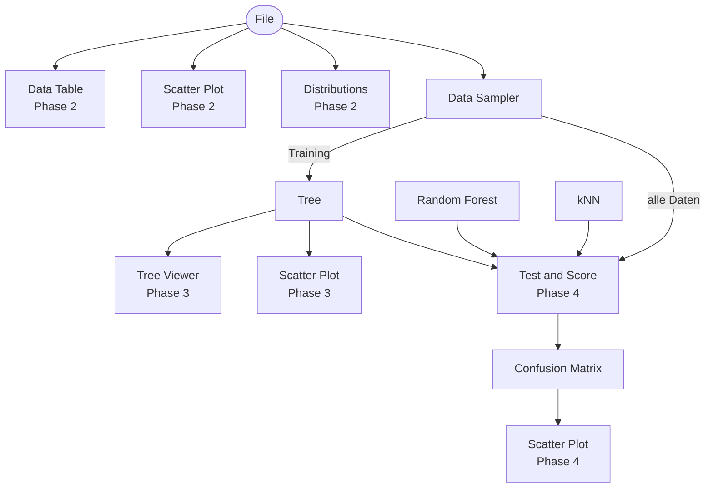
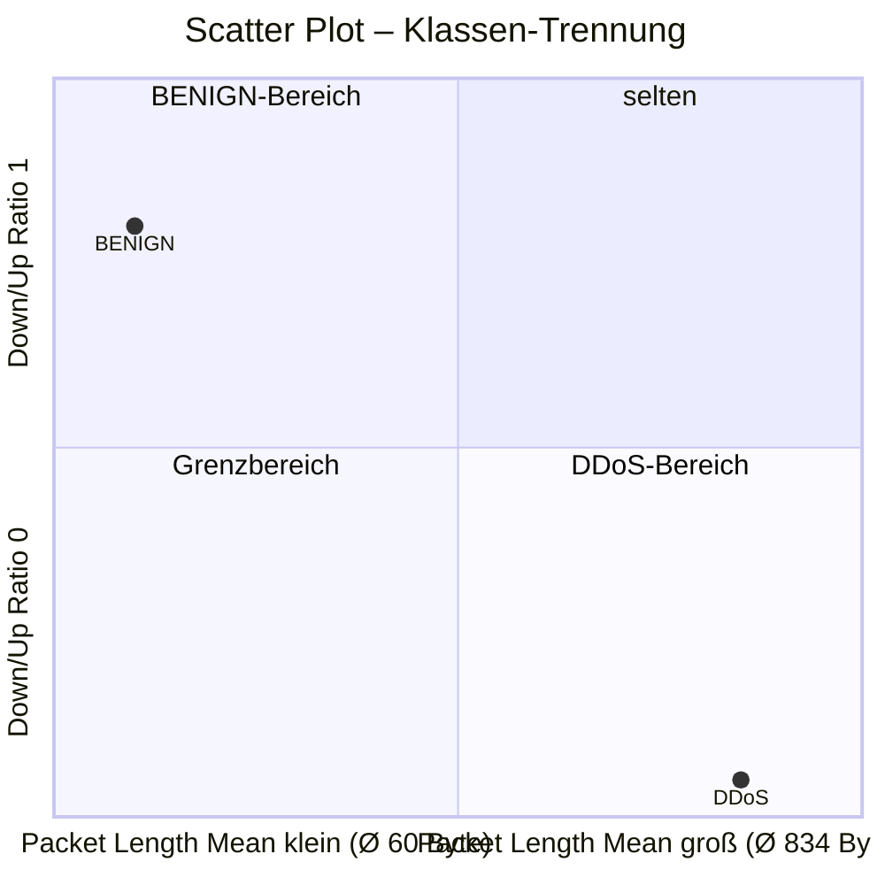
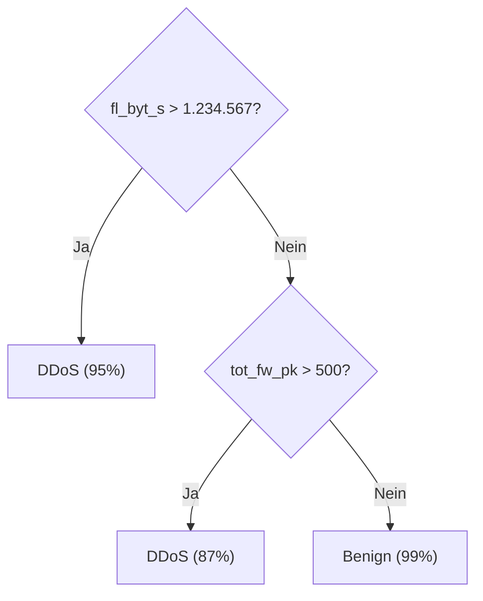
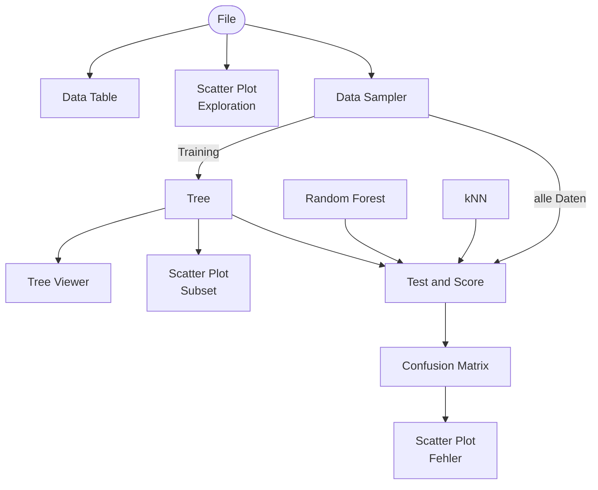

# Orange Klassifikations-Workflow

**Zusammenfassung**: Schritt-für-Schritt-Beschreibung des Orange-Workflows für den Workshop, von der Datensatz-Exploration bis zum Modellvergleich.

**Quellen**: (Quelle: [[Examples.md]]), (Quelle: [[Orange Data Mining.md]]), (Quelle: [[Widget Catalog.md]])

**Zuletzt aktualisiert**: 2026-04-16

---

## Gesamtworkflow

---

## Phase 1: Vorbereitung (vor dem Workshop)

**Datensatz-Subset vorbereiten** (Trainer-Aufgabe):
- CICIDS2017 CSV-Dateien herunterladen (Montag + Freitag)
- Zeilen filtern: nur Benign + DDoS behalten
- Zufällig auf 5.000–10.000 Zeilen reduzieren (ausgeglichen)
- Feature-Auswahl: 10 intuitive Features behalten (siehe [[CICFlowMeter_Features]])
- Als `workshop_ids.csv` speichern

---

## Phase 2: Daten erkunden (15 Minuten)

### Schritt 1: Datei laden
**Widget**: `File`
- CSV-Datei öffnen: `workshop_ids.csv`
- Prüfen: richtige Anzahl Zeilen, richtige Spaltennamen

**Lernziel**: Was sind „Daten" in Data Mining? Jede Zeile = ein Netzwerkflow.

### Schritt 2: Daten anschauen
**Widget**: `Data Table`
- Verbinde: `File → Data Table`
- Durch die Spalten scrollen
- Welche Werte haben Features bei Benign vs. DDoS?

**Diskussionsfrage**: „Was fällt euch auf? Wo sind die Unterschiede?"

### Schritt 3: Visualisierung
**Widget**: `Scatter Plot`
- Verbinde: `File → Scatter Plot`
- X-Achse: `Packet Length Mean`
- Y-Achse: `Down/Up Ratio`
- Farbe: `Label` (Klasse)

**Erwartetes Ergebnis** (aus echten Daten bestätigt):

**Didaktischer Mehrwert**: `Down/Up Ratio = 0` bedeutet: der Angreifer sendet, bekommt aber keine Antwort – der Opfer-Server ist überlastet. Das kennt jede Cisco-Lehrkraft.

**Alternative**: X = `Packet Length Mean`, Y = `Flow Duration` (DDoS: lange Flows mit großen Paketen)

**Lernziel**: Daten haben eine Struktur – und diese Struktur kann ein Modell lernen.

---

## Phase 3: Klassifikation mit Entscheidungsbaum (25 Minuten)

### Schritt 4: Train/Test-Split
**Widget**: `Data Sampler`
- Verbinde: `File → Data Sampler`
- Einstellung: 70% Training / 30% Test
- Ausgänge: Training Data → weiter zum Modell

### Schritt 5: Entscheidungsbaum trainieren
**Widget**: `Tree`
- Verbinde: `Data Sampler (Training) → Tree`
- Standardeinstellungen reichen für Demo

### Schritt 6: Baum visualisieren
**Widget**: `Tree Viewer`
- Verbinde: `Tree → Tree Viewer`
- Baum zeigt lesbare Regeln, z. B.:

**Lernziel**: KI = erlernbare Regeln. Der Baum ist erklärbar, nicht magisch.

**Diskussionsfrage**: „Ergeben diese Regeln für euch als Netzwerker Sinn?"

### Schritt 7: Baum + Scatter Plot verknüpfen
- Verbinde: `Tree → Scatter Plot` (zusätzlich zu `File → Scatter Plot`)
- Im Tree Viewer einen Knoten anklicken → die zugehörigen Datenpunkte leuchten im Scatter Plot auf

**Lernziel**: Interaktivität – Orange verbindet Modell und Daten visuell.

---

## Phase 4: Modellbewertung (20 Minuten)

### Schritt 8: Test and Score
**Widget**: `Test and Score`
- Verbinde: `File → Test and Score`
- Verbinde: `Tree → Test and Score`
- Methode: Cross-Validation (10-fold)

**Ergebnisse zeigen**:
- Accuracy (Genauigkeit)
- AUC (Area Under Curve)
- F1-Score

**Diskussionsfrage**: „98% Genauigkeit – ist das gut genug für ein echtes IDS?"

### Schritt 9: Confusion Matrix
**Widget**: `Confusion Matrix`
- Verbinde: `Test and Score → Confusion Matrix`

| | **Vorhergesagt: BENIGN** | **Vorhergesagt: DDoS** |
|---|---|---|
| **Tatsächlich: BENIGN** | 4850 ✓ | 150 ← Fehlalarme (FP) |
| **Tatsächlich: DDoS** | 20 ← Übersehene Angriffe (FN) | 4980 ✓ |

**Lernziel**: Precision, Recall, False Positives – jetzt im echten Kontext.

**Diskussionsfrage**: „Was ist schlimmer für ein IDS: False Positive oder False Negative?"

### Schritt 10: Fehlklassifizierungen im Scatter Plot
- Verbinde: `Confusion Matrix → Scatter Plot`
- Im Confusion Matrix Widget die False Positives auswählen
- Im Scatter Plot: Wo liegen die falsch klassifizierten Punkte?

**Lernziel**: Fehlklassifizierungen passieren an den Klassengrenzen – das ist erwartbares Verhalten.

---

## Phase 5: Modellvergleich (10 Minuten)

### Schritt 11: Weitere Modelle hinzufügen
**Widgets**: `Random Forest`, `kNN`
- Beide zusätzlich mit `Test and Score` verbinden
- `Test and Score` zeigt jetzt alle drei Modelle im Vergleich

**Erwartetes Ergebnis**:
- Random Forest: höchste Genauigkeit, aber Blackbox
- Tree: interpretierbar, etwas weniger genau
- kNN: einfach, aber langsam bei großen Daten

**Diskussionsfrage**: „Würdet ihr den besten Klassifikator einsetzen – oder den, den ihr erklären könnt?"

---

## Vollständige Widget-Verbindungen

## Tipps für den Trainer

- **Orange vorab installieren und Workflow speichern** – Teilnehmer können laden statt neu bauen
- **Farbschema prüfen**: Klassen `Benign` und `DDoS` sollten im Scatter Plot gut unterscheidbar sein
- **Data Sampler nutzen**, wenn der Datensatz zu groß ist (Orange kann mit großen CSVs langsam werden)
- **Tree Viewer ist das Herzstück**: Hier entsteht das größte Aha-Erlebnis – ausreichend Zeit einplanen

## Verwandte Seiten

- [[Orange_Data_Mining]]
- [[CICIDS2017]]
- [[Angriffsszenarien]]
- [[Workshop_Konzept]]
- [[CICFlowMeter_Features]]
