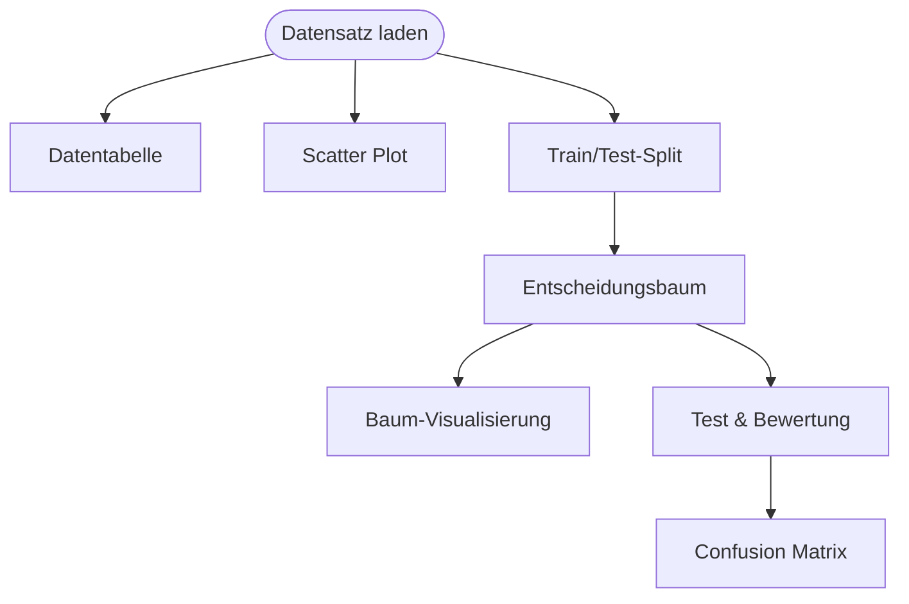

# Workshop-Handout

**Zusammenfassung**: Einseitiges Handout für Workshop-Teilnehmer – Kurzanleitung, Begriffe und Diskussionsfragen.

**Quellen**: (Quelle: [[Workshop_Arbeitsplan.md]]), (Quelle: [[Orange_Klassifikations_Workflow.md]])

**Zuletzt aktualisiert**: 2026-04-19

---

*Das folgende Dokument ist für den Ausdruck (A4, Vorder- und Rückseite) konzipiert.*

---

# VORDERSEITE

---

# KI erkennt Netzwerkangriffe
## Einführung in Data Mining mit Orange Data Mining

**Workshop · 90 Minuten · Cisco Academy / Berufliche Schulen**

---

## Das Szenario

Ein Unternehmensnetzwerk ist durch eine **Cisco NGFW** (Next-Generation Firewall) geschützt. Sie analysiert jeden Paket-Header gegen eine Signatur-Datenbank – *Deep Packet Inspection* (DPI).

**Das Problem:** Bei einem DDoS-Angriff treffen Tausende Flows/Sekunde ein. Die NGFW-CPU steigt auf 100 %, Alarme häufen sich, Administratoren ignorieren sie (*Alert Fatigue*) – und der echte Angriff bleibt unbemerkt.

**Die Idee:** Ein einfaches ML-Modell filtert bösartigen Traffic *vor* der DPI-Stufe – anhand statistischer Flow-Merkmale, ohne Payload-Inspektion.

**Unser Datensatz:** 10.000 Flows aus CICIDS2017 (Univ. New Brunswick):
5.000 BENIGN (normaler Betrieb) + 5.000 DDoS (LOIC-HTTP-Angriff).

**Unsere Aufgabe:** Ein ML-Modell trainieren, das BENIGN und DDoS zuverlässig trennt.

---

## Orange – Kurzanleitung

Orange ist ein visuelles Data-Mining-Werkzeug. **Widgets** werden mit Pfeilen verbunden – kein Programmieren nötig.

### Schritt für Schritt

| Schritt | Widget | Was tun |
|---|---|---|
| 1 | **Datensatz laden** | Datei `workshop_ids.tab` öffnen |
| 2 | **Datentabelle** | Spalten ansehen – was bedeuten die Werte? |
| 3 | **Scatter Plot** | X = `Packet Length Mean`, Y = `Down/Up Ratio`, Farbe = `Label` |
| 4 | **Train/Test-Split** | 70 % Training / 30 % Test |
| 5 | **Entscheidungsbaum** | Standardeinstellungen, mit Train/Test-Split verbinden |
| 6 | **Baum-Visualisierung** | Regeln lesen: Was hat das Modell gelernt? |
| 7 | **Test & Bewertung** | Accuracy, AUC ablesen |
| 8 | **Confusion Matrix** | Fehlalarme und übersehene Angriffe zählen |
| 9 | **Random Forest, kNN** | Beide mit Test & Bewertung verbinden, Vergleich |

---

## Die wichtigsten Features unseres Datensatzes

| Feature | Bedeutung | BENIGN | DDoS |
|---|---|---|---|
| `Packet Length Mean` | Ø Paketgröße in Byte | ~60 Byte | ~834 Byte |
| `Down/Up Ratio` | Verhältnis empfangen/gesendet | ~1,0 | **0,0** |
| `Flow Duration` | Dauer der Verbindung | ~31 ms | ~1.893 ms |
| `Flow Packets/s` | Pakete pro Sekunde | ~119 | ~2,5 |
| `SYN Flag Count` | Anzahl SYN-Pakete | ~0,06 | ~0,0 |

---

# RÜCKSEITE

---

## Begriffe auf einen Blick

| Begriff | Bedeutung |
|---|---|
| **Flow** | Eine Netzwerkverbindung als statistische Zusammenfassung (kein Payload) |
| **Feature** | Eine messbare Eigenschaft eines Flows (z. B. Paketgröße, Dauer) |
| **Label / Klasse** | Die bekannte Kategorie eines Datenpunkts: `BENIGN` oder `DDoS` |
| **Klassifikation** | Ein Modell lernt, unbekannte Flows einer Klasse zuzuordnen |
| **Entscheidungsbaum** | Modell aus lesbaren Wenn-Dann-Regeln |
| **Training** | Modell lernt aus bekannten Daten (70 %) |
| **Test** | Modell wird auf unbekannten Daten geprüft (30 %) |
| **Accuracy** | Anteil richtig klassifizierter Flows |
| **True Positive (TP)** | Angriff korrekt als Angriff erkannt |
| **False Positive (FP)** | Normaler Flow fälschlicherweise als Angriff gemeldet → **Fehlalarm** |
| **False Negative (FN)** | Angriff nicht erkannt → **übersehener Angriff** |
| **Confusion Matrix** | Tabelle mit TP, TN, FP, FN |
| **Cross-Validation** | Mehrfaches Testen auf verschiedenen Datenteilmengen → robustere Bewertung |
| **Black Box** | Modell, das gute Ergebnisse liefert, aber nicht erklärbar ist (z. B. Random Forest) |

---

## Diskussionsfragen

### Zur Datenexploration
- Was seht ihr im Scatter Plot? Warum ist `Down/Up Ratio = 0` bei DDoS?
- Welche anderen Features würden euch als Netzwerker interessieren?

### Zum Modell
- Lest die oberste Verzweigung im Entscheidungsbaum laut vor. Ergibt sie Sinn?
- Warum kann ein Entscheidungsbaum im Unternehmenseinsatz sinnvoller sein als Random Forest?

### Zur Bewertung
- Euer Modell hat 98 % Accuracy. Bei 10.000 Flows pro Stunde – wie viele Fehlentscheidungen sind das?
- Was ist schlimmer: ein **Fehlalarm** (FP) oder ein **übersehener Angriff** (FN)?
- Was ist **Alert Fatigue** – und wie hängt es mit False Positives zusammen?

### Zum Transfer
- Wie könnte ihr diesen Workshop in euren eigenen Unterricht einbauen?
- Für welche Jahrgangsstufe / welches Fach wäre das geeignet?
- Welche anderen Datensätze könnten eure Schülerinnen und Schüler interessieren?

---

## Weiterführende Ressourcen

| Ressource | Beschreibung |
|---|---|
| **orangedatamining.com** | Orange herunterladen, Tutorials, Beispiel-Workflows |
| **CICIDS2017** | Vollständiger Datensatz: cicresearch.ca/CICDataset/CIC-IDS-2017 |
| **Orange Beispiele** | orangedatamining.com/examples – viele fertige Workflows |

---

*Datensatz: CICIDS2017, Canadian Institute for Cybersecurity, Univ. of New Brunswick*
*Tool: Orange Data Mining 3, Bioinformatics Laboratory, Univ. of Ljubljana (Open Source)*
